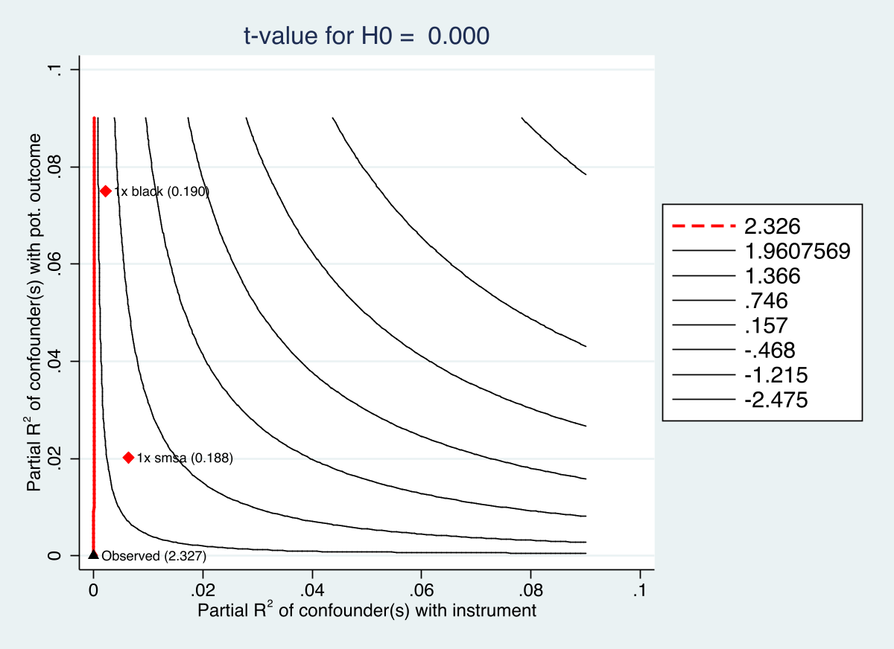

# ivsensemakr: Sensitivity Analysis Tools for IV (Stata)

`ivsensemakr` for Stata implements a suite of sensitivity analysis tools
for instrumental variable (IV) estimates, extending the omitted variable
bias framework to IV settings, as discussed in [Cinelli, C. and Hazlett, C.
(2025) "An Omitted Variable Bias Framework for Sensitivity Analysis of
Instrumental Variables." *Biometrika*.](https://doi.org/10.1093/biomet/asaf004)
([PDF](https://carloscinelli.com/files/Cinelli%20and%20Hazlett%20-%20OVB%20for%20IV.pdf))

# Related Packages

- Download the R package here:
  <https://github.com/carloscinelli/iv.sensemakr>

- Download the OLS Stata version here:
  <https://github.com/resonance1/sensemakr-stata>


# Installation

To install the current github version, run:

```
net install ivsensemakr, all replace force from("https://raw.githubusercontent.com/carloscinelli/iv.sensemakr-stata/master/")
```

# Basic Usage

```
// Load dataset (Card, 1995)
use card.dta, clear

// Run sensitivity analysis with benchmark covariates
ivsensemakr lwage educ nearc4 exper expersq black south smsa ///
    reg661 reg662 reg663 reg664 reg665 reg666 reg667 reg668 smsa66, ///
    benchmark(black smsa)
```

```
// Generate contour plots of adjusted confidence interval limits
ivsensemakr lwage educ nearc4 exper expersq black south smsa ///
    reg661 reg662 reg663 reg664 reg665 reg666 reg667 reg668 smsa66, ///
    benchmark(black smsa) contourplot clim(0 0.09)
```
<p align = "center">

</p>

```
// Generate t-contour plot
ivsensemakr lwage educ nearc4 exper expersq black south smsa ///
    reg661 reg662 reg663 reg664 reg665 reg666 reg667 reg668 smsa66, ///
    benchmark(black smsa) tcontourplot clim(0 0.09)
```
<p align = "center">

</p>
