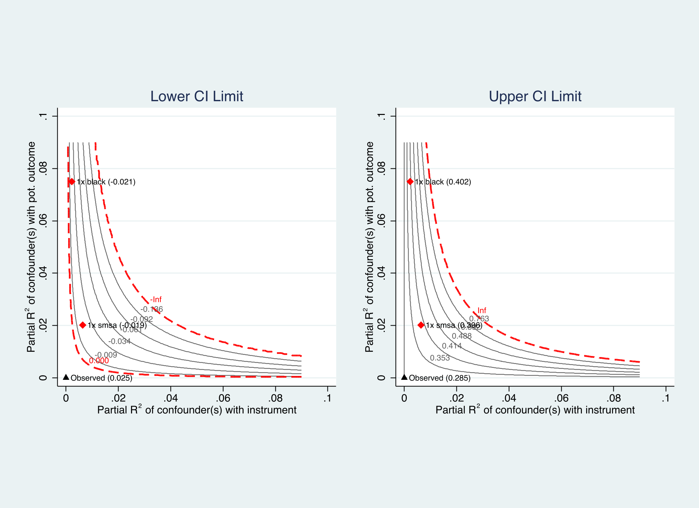

# ivsensemakr: Sensitivity Analysis Tools for IV (Stata)

`ivsensemakr` for Stata implements a suite of sensitivity analysis tools
for instrumental variable (IV) estimates, extending the omitted variable
bias framework to IV settings, as discussed in [Cinelli, C. and Hazlett, C.
(2025) "An Omitted Variable Bias Framework for Sensitivity Analysis of
Instrumental Variables." *Biometrika*.](https://doi.org/10.1093/biomet/asaf004)
([PDF](https://carloscinelli.com/files/Cinelli%20and%20Hazlett%20-%20OVB%20for%20IV.pdf))

# Related Packages

- Download the R package here:
  <https://github.com/carloscinelli/iv.sensemakr>

- Download the OLS Stata version here:
  <https://github.com/resonance1/sensemakr-stata>


# Installation

To install the current github version, run:

```
net install ivsensemakr, all replace force from("https://raw.githubusercontent.com/carloscinelli/iv.sensemakr-stata/master/")
```

# Basic Usage

```stata
// Load dataset (Card, 1995)
use card.dta, clear

// Generate contour plots of adjusted confidence interval limits
ivsensemakr lwage educ nearc4 exper expersq black south smsa ///
    reg661 reg662 reg663 reg664 reg665 reg666 reg667 reg668 smsa66, ///
    benchmark(black smsa) contourplot clim(0 0.09)
```

Output:

```
Sensitivity Analysis for Instrumental Variables
(Anderson-Rubin Approach)
-----------------------------------------------------------------
IV Estimates:
  Coef. Estimate:  0.1315
  Conf. Interval:  [0.0248, 0.2848]

Sensitivity Statistics:
  Extreme Robustness Value:  0.0005
  Robustness Value:          0.0067

Bounds on Omitted Variable Bias:
  Bound Label          R2zw.x    R2y0w.zx    Lower CI    Upper CI
  ---------------------------------------------------------------
  1x black            0.00221     0.07500     -0.0212      0.4019
  1x smsa             0.00639     0.02018     -0.0192      0.3958

Note: H0 = 0, q >= 1, alpha = .05, df = 2994.
-----------------------------------------------------------------
First-Stage Estimates:
  Coef. Estimate:  0.3199
  Standard Error:  0.0879
  t-value:         3.6408
  p-value:         0.0003
  Conf. Interval:  [0.1476, 0.4922]

Sensitivity Statistics:
  Extreme Robustness Value:  0.0031
  Robustness Value:          0.0302

Bounds on Omitted Variable Bias:
  Bound Label          R2zw.x     R2dw.zx    Lower CI    Upper CI
  ---------------------------------------------------------------
  1x black            0.00221     0.03342      0.1089      0.5309
  1x smsa             0.00639     0.00498      0.1202      0.5195

Note: H0 = 0, q = 1, alpha = .05, df = 2994.
-----------------------------------------------------------------
Reduced-Form Estimates:
  Coef. Estimate:  0.0421
  Standard Error:  0.0181
  t-value:         2.3271
  p-value:         0.0200
  Conf. Interval:  [0.0066, 0.0775]

Sensitivity Statistics:
  Extreme Robustness Value:  0.0005
  Robustness Value:          0.0067

Bounds on Omitted Variable Bias:
  Bound Label          R2zw.x     R2yw.zx    Lower CI    Upper CI
  ---------------------------------------------------------------
  1x black            0.00221     0.06566     -0.0042      0.0883
  1x smsa             0.00639     0.01973     -0.0043      0.0884

Note: H0 = 0, q = 1, alpha = .05, df = 2994.
-----------------------------------------------------------------
```

<p align = "center">

</p>
